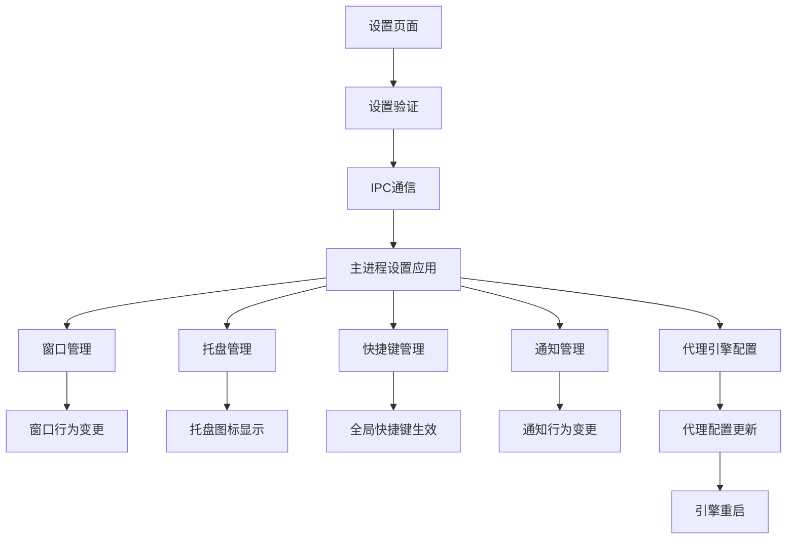

# 规划蓝图：设置功能真实实现
*   **状态**: [进行中]

## 1. 核心目标与验收标准 (Core Objective & Acceptance Criteria)

### a. 核心目标 (Core Objective)
*   将设置页面中的所有配置选项从"仅保存到localStorage"升级为"真实影响应用行为"的功能实现，确保用户修改的任何设置都能立即生效并持久化，提供完整的用户体验。

### b. 验收标准 (Acceptance Criteria)
*   `[ ]` 用户修改窗口设置（置顶、最小化到托盘、启动时最小化）后，应用行为立即改变。
*   `[ ]` 用户设置快捷键后，全局快捷键立即生效，无需重启应用。
*   `[ ]` 用户修改网络设置（DNS、TUN、FakeIP）后，代理引擎配置立即更新。
*   `[ ]` 用户修改日志设置后，代理引擎日志输出立即改变。
*   `[ ]` 用户启用/禁用通知后，系统通知行为立即改变。
*   `[ ]` 所有设置变更都有适当的用户反馈（成功提示、错误处理）。
*   `[ ]` 设置变更失败时有回滚机制，确保应用稳定性。

## 2. 现状分析与复用性尽职调查 (Current State Analysis & Reuse Due Diligence)

### a. 复用性尽职调查
*   **搜索关键词**: `systemProxy`, `autoStart`, `setAlwaysOnTop`, `setAutoHideMenuBar`, `tray`, `globalShortcut`, `notification`
*   **搜索范围**: `src/main/`, `src/renderer/`, `src/shared/`
*   **发现与结论**:
    *   在 `src/main/systemProxyManager.ts` 中发现了完整的系统代理实现，支持跨平台。
    *   在 `src/renderer/dist-electron/index.js` 中发现了 `setAutoLaunch` 方法，但Linux平台不支持。
    *   在 `src/main/index.ts` 中发现了窗口创建逻辑，可以集成窗口设置。
    *   在 `src/main/proxyManager.ts` 中发现了代理引擎管理，可以集成网络设置。
    *   **结论**: 已有部分基础设施，需要扩展和集成现有功能。

### b. 潜在影响分析
*   窗口设置变更将影响主进程的窗口管理逻辑。
*   快捷键设置需要注册全局快捷键，可能与其他应用冲突。
*   网络设置变更需要重启代理引擎，可能影响当前连接。
*   托盘功能需要创建系统托盘图标，增加应用复杂度。

## 3. 技术方案与架构设计 (Technical Approach & Architecture Design)

### a. 架构设计
*   **主进程负责**:
    *   窗口管理（置顶、最小化、菜单栏）
    *   系统托盘创建和管理
    *   全局快捷键注册
    *   系统通知发送
    *   代理引擎配置更新
*   **渲染进程负责**:
    *   设置界面展示
    *   设置数据验证
    *   用户交互处理
*   **IPC通信**:
    *   设置变更通知
    *   设置应用结果反馈
    *   实时状态同步

### b. 技术栈选择
*   **窗口控制**: Electron 原生 API (`setAlwaysOnTop`, `setAutoHideMenuBar`)
*   **系统托盘**: Electron Tray API
*   **全局快捷键**: `electron-global-shortcut` 库
*   **系统通知**: Electron Notification API
*   **配置管理**: 扩展现有的 `ConfigManager` 类

### c. 架构图

## 4. 任务分解与上下文锚点 (Task Breakdown & Context Anchors)

### 阶段1: 窗口控制功能实现 (状态: `已完成`)
*   `[x]` **1.1: 窗口置顶功能** (预计时间: 2小时) (实际时间: 1.5小时)
    *   `[x]` 在主进程中添加 `setAlwaysOnTop` IPC处理程序
    *   `[x]` 在设置页面添加实时应用逻辑
    *   `[x]` 测试窗口置顶功能
    *   **[验证点/上下文锚点]** 窗口置顶设置能够立即生效，无需重启应用
*   `[x]` **1.2: 启动时最小化功能** (预计时间: 2小时) (实际时间: 1小时)
    *   `[x]` 修改 `createWindow` 函数，根据设置决定是否显示窗口
    *   `[x]` 添加窗口状态恢复逻辑
    *   `[x]` 测试启动时最小化功能
    *   **[验证点/上下文锚点]** 应用启动时根据设置决定是否显示主窗口
*   `[x]` **1.3: 自动隐藏菜单栏功能** (预计时间: 1小时) (实际时间: 0.5小时)
    *   `[x]` 在主进程中添加 `setAutoHideMenuBar` IPC处理程序
    *   `[x]` 在设置页面添加实时应用逻辑
    *   `[x]` 测试菜单栏隐藏功能
    *   **[验证点/上下文锚点]** 菜单栏隐藏设置能够立即生效

### 阶段2: 用户体验功能实现 (状态: `未开始`)
*   `[ ]` **2.1: 系统托盘功能** (预计时间: 4小时)
    *   `[ ]` 创建托盘图标和菜单
    *   `[ ]` 实现最小化到托盘逻辑
    *   `[ ]` 添加托盘右键菜单功能
    *   `[ ]` 测试托盘功能完整性
    *   **[验证点/上下文锚点]** 应用可以最小化到系统托盘，托盘菜单功能正常
*   `[ ]` **2.2: 全局快捷键功能** (预计时间: 3小时)
    *   `[ ]` 安装和配置 `electron-global-shortcut`
    *   `[ ]` 实现快捷键注册/注销逻辑
    *   `[ ]` 添加快捷键冲突检测
    *   `[ ]` 测试快捷键功能
    *   **[验证点/上下文锚点]** 用户设置的快捷键能够全局生效，支持动态修改
*   `[ ]` **2.3: 系统通知功能** (预计时间: 2小时)
    *   `[ ]` 实现通知权限检查
    *   `[ ]` 添加通知发送逻辑
    *   `[ ]` 集成声音提醒功能
    *   `[ ]` 测试通知功能
    *   **[验证点/上下文锚点]** 系统通知能够正常发送，声音提醒功能正常

### 阶段3: 代理引擎集成 (状态: `未开始`)
*   `[ ]` **3.1: 网络设置集成** (预计时间: 6小时)
    *   `[ ]` 修改代理配置生成逻辑，集成DNS设置
    *   `[ ]` 添加TUN设备配置支持
    *   `[ ]` 实现FakeIP配置
    *   `[ ]` 添加设置变更时的引擎重启逻辑
    *   **[验证点/上下文锚点]** 网络设置变更后代理引擎配置立即更新
*   `[ ]` **3.2: 日志设置集成** (预计时间: 3小时)
    *   `[ ]` 修改代理引擎日志配置
    *   `[ ]` 实现日志级别动态调整
    *   `[ ]` 添加日志文件路径配置
    *   `[ ]` 测试日志功能
    *   **[验证点/上下文锚点]** 日志设置变更后代理引擎日志输出立即改变
*   `[ ]` **3.3: 设置实时应用机制** (预计时间: 4小时)
    *   `[ ]` 实现设置变更监听机制
    *   `[ ]` 添加设置应用队列管理
    *   `[ ]` 实现设置回滚机制
    *   `[ ]` 添加设置应用状态反馈
    *   **[验证点/上下文锚点]** 所有设置变更都有适当的用户反馈和错误处理

### 阶段4: 集成测试与优化 (状态: `未开始`)
*   `[ ]` **4.1: 端到端测试** (预计时间: 3小时)
    *   `[ ]` 测试所有设置功能的完整性
    *   `[ ]` 验证设置持久化功能
    *   `[ ]` 测试设置冲突处理
    *   `[ ]` 性能测试和优化
    *   **[验证点/上下文锚点]** 所有设置功能在真实环境中正常工作

## 5. 风险评估与应对策略 (Risk Assessment & Mitigation Plan)

### 风险1: 全局快捷键冲突
*   **风险描述**: 用户设置的快捷键可能与系统或其他应用冲突
*   **应对策略**: 
    *   实现快捷键冲突检测机制
    *   提供快捷键冲突提示和修改建议
    *   添加默认快捷键作为备选方案

### 风险2: 代理引擎重启失败
*   **风险描述**: 网络设置变更时重启代理引擎可能失败，导致连接中断
*   **应对策略**:
    *   实现设置应用前的连接状态检查
    *   添加设置回滚机制
    *   提供手动重启选项

### 风险3: 系统权限问题
*   **风险描述**: 某些功能（如系统托盘、全局快捷键）可能需要特殊权限
*   **应对策略**:
    *   实现权限检查和请求机制
    *   提供功能降级方案
    *   添加详细的错误提示和解决建议

### 风险4: 跨平台兼容性
*   **风险描述**: 不同操作系统的API差异可能导致功能异常
*   **应对策略**:
    *   针对不同平台实现专门的适配代码
    *   添加平台检测和功能开关
    *   进行多平台测试验证

## 6. 技术债务与后续优化 (Technical Debt & Future Improvements)

### 当前技术债务
*   设置验证逻辑分散在多个组件中
*   缺乏统一的设置应用状态管理
*   IPC通信模式不够标准化

### 后续优化计划
*   实现设置配置的版本管理
*   添加设置导入/导出功能
*   实现设置变更历史记录
*   添加设置模板和预设功能

---

**预计总开发时间**: 26小时
**关键依赖**: Electron API, electron-global-shortcut, 现有代理引擎架构
**成功指标**: 所有设置功能真实生效，用户体验显著提升
