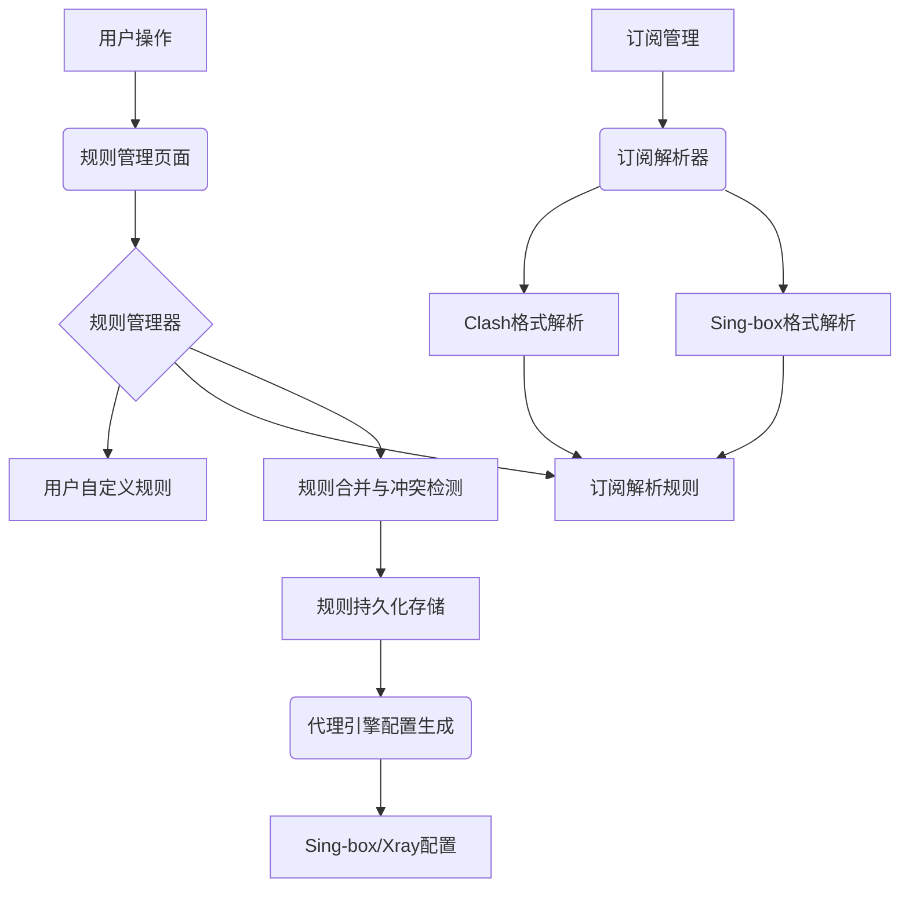

# 规划蓝图：规则管理页面与订阅解析优化
*   **状态**: [已完成]

## 1. 核心目标与验收标准 (Core Objective & Acceptance Criteria)

### a. 核心目标 (Core Objective)
*   为虫洞应用增加完整的规则管理功能，并优化订阅解析组件以支持带分流规则的订阅链接，提升用户对代理流量的精细化控制能力。

### b. 验收标准 (Acceptance Criteria)
*   `[ ]` 用户可以在规则管理页面中创建、编辑、删除和管理路由规则。
*   `[ ]` 支持多种规则类型：域名规则、IP规则、地理位置规则、进程规则、协议规则。
*   `[ ]` 支持多种规则动作：代理、直连、阻止、代理链。
*   `[ ]` 规则支持优先级设置和排序。
*   `[ ]` 订阅解析组件能够正确解析包含分流规则的Clash、Sing-box等格式。
*   `[ ]` 解析的规则能够与用户自定义规则进行合并和管理。
*   `[ ]` 规则配置能够正确应用到代理引擎中。
*   `[ ]` 提供规则的导入/导出功能。

## 2. 现状分析与复用性尽职调查 (Current State Analysis & Reuse Due Diligence)

### a. 复用性尽职调查
*   **搜索关键词**: `routing`, `rule`, `chain`, `proxy`, `subscription`, `clash`, `singbox`
*   **搜索范围**: `src/renderer/`, `src/shared/`
*   **发现与结论**:
    *   在 `src/renderer/utils/chainProxy.ts` 中发现了 `RoutingRule` 接口定义，包含基本的规则结构。
    *   在 `src/renderer/utils/subscriptionManager.ts` 中有基础的订阅解析功能，但缺乏对分流规则的完整支持。
    *   在 `src/renderer/utils/proxyEngine.ts` 中有基础的Sing-box配置生成逻辑。
    *   **结论**: 需要扩展现有的规则系统，增强订阅解析功能，并创建完整的规则管理界面。

### b. 潜在影响分析
*   本次修改将扩展现有的类型定义，增加规则相关的数据结构。
*   将创建新的规则管理页面，需要集成到现有的导航系统中。
*   需要修改订阅解析逻辑以支持分流规则。
*   需要更新代理引擎配置生成逻辑以支持规则应用。

## 3. 技术方案与架构设计 (Technical Approach & Architecture Design)

### a. 后端/核心逻辑
*   **规则管理系统**:
    *   扩展现有的 `RoutingRule` 接口，增加更多规则类型和属性。
    *   创建 `RuleManager` 类来管理用户自定义规则和订阅规则。
    *   实现规则的优先级排序、冲突检测和合并逻辑。
    *   提供规则的持久化存储和导入/导出功能。
*   **订阅解析增强**:
    *   增强 `SubscriptionManager` 的解析能力，支持Clash、Sing-box等格式的分流规则。
    *   实现规则的去重和合并逻辑。
    *   支持规则的批量导入和管理。

### b. 前端
*   **规则管理页面**:
    *   创建 `RuleManagement.tsx` 页面，提供完整的规则管理界面。
    *   实现规则的增删改查、排序、批量操作等功能。
    *   提供规则的预览和测试功能。
    *   集成到现有的导航系统中。
*   **订阅管理增强**:
    *   在订阅管理页面中增加规则解析和管理的功能。
    *   显示订阅中包含的规则信息。
    *   提供规则的选择性导入功能。

### c. 架构图

## 4. 任务分解与上下文锚点 (Task Breakdown & Context Anchors)

*   `[x]` **里程碑1: 规则系统基础建设** (状态: `已完成`)
    *   `[x]` 1.1: 扩展类型定义，增加完整的规则相关接口... (对应Commit: `规则系统基础建设`)
    *   `[x]` 1.2: 创建 `RuleManager` 类，实现规则管理核心逻辑...
    *   `[x]` 1.3: 实现规则的持久化存储和导入/导出功能...
    *   `[x]` 1.4: **(验证点/上下文锚点)** 测试规则管理器的基本功能，确保规则能够正确保存和加载。
*   `[x]` **里程碑2: 订阅解析增强** (状态: `已完成`)
    *   `[x]` 2.1: 增强 `SubscriptionManager` 的Clash格式解析能力...
    *   `[x]` 2.2: 增强 `SubscriptionManager` 的Sing-box格式解析能力...
    *   `[x]` 2.3: 实现规则的去重和合并逻辑...
    *   `[x]` 2.4: **(验证点/上下文锚点)** 测试订阅解析功能，确保能够正确解析包含分流规则的订阅。
*   `[x]` **里程碑3: 规则管理页面开发** (状态: `已完成`)
    *   `[x]` 3.1: 创建 `RuleManagement.tsx` 页面...
    *   `[x]` 3.2: 实现规则的增删改查界面...
    *   `[x]` 3.3: 实现规则的排序和批量操作功能...
    *   `[x]` 3.4: **(验证点/上下文锚点)** 测试规则管理页面的基本功能，确保界面正常工作。
*   `[x]` **里程碑4: 代理引擎集成** (状态: `已完成`)
    *   `[x]` 4.1: 修改 `ProxyEngine` 的配置生成逻辑，支持规则应用...
    *   `[x]` 4.2: 实现规则的优先级排序和冲突检测...
    *   `[x]` 4.3: 测试规则在代理引擎中的正确应用...
    *   `[x]` 4.4: **(验证点/上下文锚点)** 验证规则能够正确应用到代理配置中。
*   `[x]` **里程碑5: 集成与优化** (状态: `已完成`)
    *   `[x]` 5.1: 将规则管理页面集成到导航系统中...
    *   `[x]` 5.2: 优化订阅管理页面，增加规则相关功能...
    *   `[x]` 5.3: 进行完整的端到端测试...
    *   `[x]` 5.4: **(验证点/上下文锚点)** 完成所有功能的集成测试，确保系统正常工作。

## 5. 风险评估与应对策略 (Risk Assessment & Mitigation Plan)

*   **风险1**: 规则冲突和优先级处理复杂。
    *   **应对**: 实现清晰的规则优先级机制，提供冲突检测和解决建议。
*   **风险2**: 订阅解析可能遇到格式变化或不兼容的情况。
    *   **应对**: 实现健壮的解析逻辑，提供详细的错误信息和回退机制。
*   **风险3**: 大量规则可能影响性能。
    *   **应对**: 实现规则的懒加载和分页显示，优化规则匹配算法。
*   **风险4**: 规则配置的复杂性可能影响用户体验。
    *   **应对**: 提供规则模板和向导功能，简化规则创建过程。
