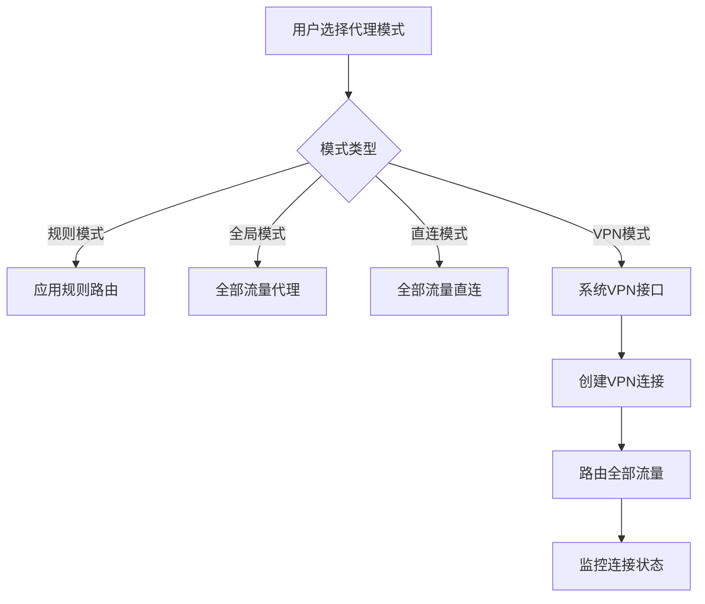

# 规划蓝图：代理模式完善与VPN模式实现
*   **状态**: [规划中]

## 1. 核心目标与验收标准 (Core Objective & Acceptance Criteria)

### a. 核心目标 (Core Objective)
*   完善现有代理模式的实现，修复字段混淆问题，并新增VPN模式选项，实现通过系统VPN接口代理全部系统流量的功能。

### b. 验收标准 (Acceptance Criteria)
*   `[ ]` 修复proxyMode和mode字段的混淆问题，统一使用mode字段
*   `[ ]` 完善规则模式、全局模式、直连模式的实现逻辑
*   `[ ]` 在代理模式选择器中新增"VPN模式"选项
*   `[ ]` 实现VPN模式的完整功能，包括创建、连接、断开系统VPN
*   `[ ]` 支持Windows、macOS、Linux平台的VPN操作
*   `[ ]` 实现VPN模式下的流量路由和DNS处理
*   `[ ]` 提供VPN连接状态监控和错误处理

## 2. 现状分析与复用性尽职调查 (Current State Analysis & Reuse Due Diligence)

### a. 复用性尽职调查
*   **搜索关键词**: `proxyMode`, `mode`, `VPN`, `vpn`, `systemProxyManager`
*   **搜索范围**: `src/`
*   **发现与结论**:
    *   在 `src/shared/types/index.ts` 中发现proxyMode和mode两个字段定义
    *   在 `src/main/systemProxyManager.ts` 中已有VPN创建、连接、断开的基础功能
    *   在 `src/renderer/pages/Settings.tsx` 中已有代理模式选择器UI
    *   **结论**: 可以复用现有的VPN基础功能和UI组件，需要完善代理模式逻辑并添加VPN模式

### b. 潜在影响分析
*   修改类型定义会影响所有使用这些字段的代码
*   新增VPN模式需要扩展代理管理器的逻辑
*   需要处理不同平台的VPN实现差异

## 3. 技术方案与架构设计 (Technical Approach & Architecture Design)

### a. 修复字段混淆问题
*   统一使用 `mode` 字段，移除 `proxyMode` 字段
*   更新所有相关类型定义和默认设置
*   确保前后端字段一致性

### b. 完善现有代理模式
*   **规则模式**: 基于用户定义的规则进行流量路由
*   **全局模式**: 所有流量都通过代理
*   **直连模式**: 所有流量直连，不经过代理

### c. VPN模式实现
*   **系统VPN接口**: 使用系统原生的VPN功能
*   **流量路由**: 通过系统VPN接口路由全部流量
*   **DNS处理**: 在VPN模式下处理DNS请求
*   **状态管理**: 监控VPN连接状态

### d. 架构图

## 4. 任务分解与上下文锚点 (Task Breakdown & Context Anchors)

*   `[ ]` **里程碑1: 修复字段混淆问题** (状态: `未开始`)
    *   `[ ]` 1.1: 更新 `src/shared/types/index.ts` 中的类型定义
    *   `[ ]` 1.2: 更新 `src/shared/defaultSettings.ts` 中的默认设置
    *   `[ ]` 1.3: 更新所有使用proxyMode字段的代码
    *   `[ ]` 1.4: **(验证点)** 确保类型定义一致性，无编译错误
*   `[ ]` **里程碑2: 完善现有代理模式** (状态: `未开始`)
    *   `[ ]` 2.1: 完善规则模式的实现逻辑
    *   `[ ]` 2.2: 完善全局模式的实现逻辑
    *   `[ ]` 2.3: 完善直连模式的实现逻辑
    *   `[ ]` 2.4: **(验证点)** 测试三种模式的切换和效果
*   `[ ]` **里程碑3: 实现VPN模式** (状态: `未开始`)
    *   `[ ]` 3.1: 扩展类型定义，添加VPN模式选项
    *   `[ ]` 3.2: 完善VPN基础功能实现
    *   `[ ]` 3.3: 实现VPN模式下的流量路由
    *   `[ ]` 3.4: 实现VPN连接状态监控
    *   `[ ]` 3.5: **(验证点)** 测试VPN模式的完整功能
*   `[ ]` **里程碑4: 集成与测试** (状态: `未开始`)
    *   `[ ]` 4.1: 集成所有模式到统一的代理管理器
    *   `[ ]` 4.2: 添加错误处理和用户提示
    *   `[ ]` 4.3: 进行跨平台测试
    *   `[ ]` 4.4: **(验证点)** 完整的功能测试和用户体验验证

## 5. 风险评估与应对策略 (Risk Assessment & Mitigation Plan)

*   **风险1**: 不同平台的VPN实现差异较大
    *   **应对**: 优先实现Windows平台，逐步完善macOS和Linux实现
*   **风险2**: 系统VPN权限问题
    *   **应对**: 添加权限检查和用户提示，提供降级方案
*   **风险3**: VPN连接稳定性问题
    *   **应对**: 实现自动重连和连接状态监控
*   **风险4**: 与现有代理功能的冲突
    *   **应对**: 确保模式切换时正确清理之前的连接和配置
