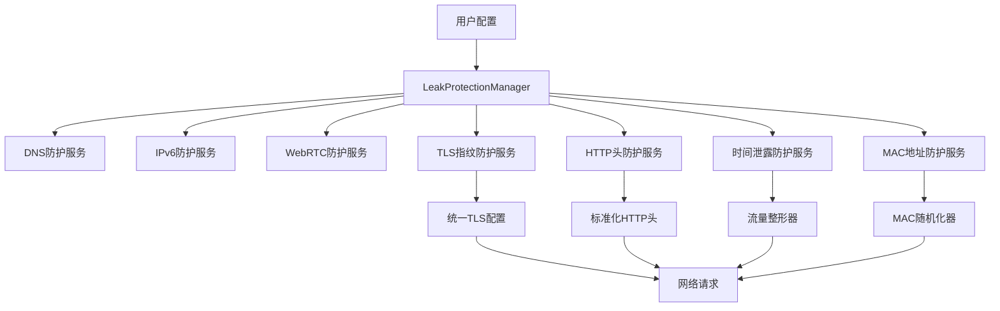

# 规划蓝图：高级泄露防护功能增强
*   **状态**: [规划中]

## 1. 核心目标与验收标准 (Core Objective & Acceptance Criteria)

### a. 核心目标 (Core Objective)
*   为虫洞代理客户端应用补全高级网络隐私泄露防护功能，在现有DNS、IPv6、WebRTC泄露防护基础上，新增TLS指纹泄露、HTTP头泄露、时间泄露、MAC地址泄露等关键防护功能，构建完整的网络隐私保护体系，满足高级用户对网络隐私的极致保护需求。

### b. 验收标准 (Acceptance Criteria)
*   `[ ]` 用户可以在设置页面看到新增的"高级泄露防护"配置区域，包含TLS指纹、HTTP头、时间泄露、MAC地址等防护选项。
*   `[ ]` 系统能够检测并防护TLS指纹泄露，统一客户端TLS握手信息，防止通过TLS特征识别客户端类型。
*   `[ ]` 系统能够检测并防护HTTP头泄露，标准化User-Agent、Accept-Language等敏感头部信息。
*   `[ ]` 系统能够检测并防护时间泄露，通过请求时间随机化和流量整形防止行为模式分析。
*   `[ ]` 系统能够检测并防护MAC地址泄露，实现网络接口MAC地址随机化。
*   `[ ]` 所有新增防护功能必须与现有DNS、IPv6、WebRTC防护功能无缝集成，形成统一的泄露防护管理界面。
*   `[ ]` 系统提供实时泄露检测和防护状态监控，用户能够查看详细的防护报告和风险分析。

## 2. 现状分析与复用性尽职调查 (Current State Analysis & Reuse Due Diligence)

### a. 复用性尽职调查
*   **搜索关键词**: `leak protection`, `dns leak`, `ipv6 leak`, `webrtc leak`, `tls fingerprint`, `http header`, `timing attack`, `mac address`
*   **搜索范围**: `src/main/services/`, `src/renderer/pages/`, `src/shared/`
*   **发现与结论**:
    *   在 `src/main/services/leakProtectionManager.ts` 中发现了完整的泄露防护管理器，已实现DNS、IPv6、WebRTC三种泄露防护。
    *   在 `src/main/services/dnsService.ts` 中发现了DNS泄露防护的具体实现。
    *   在 `src/main/services/ipv6LeakProtectionService.ts` 和 `src/main/services/webRTCLeakProtectionService.ts` 中发现了IPv6和WebRTC泄露防护服务。
    *   在 `src/renderer/pages/Settings.tsx` 中发现了泄露防护的UI配置界面。
    *   在 `src/shared/types/index.ts` 和 `src/shared/defaultSettings.ts` 中发现了相关的类型定义和默认配置。
    *   **结论**: 现有架构完善，可以基于现有的LeakProtectionManager扩展新的防护功能，复用现有的UI框架和配置管理机制。

### b. 潜在影响分析
*   本次修改将在现有泄露防护体系基础上新增4种高级防护功能，需要扩展LeakProtectionManager和相关服务类。
*   需要新增相应的类型定义和默认配置，但不会影响现有功能的稳定性。
*   前端UI需要扩展设置页面，但可以复用现有的配置框架。

## 3. 技术方案与架构设计 (Technical Approach & Architecture Design)

### a. 后端架构
*   **扩展LeakProtectionManager**: 在现有管理器基础上新增TLS指纹、HTTP头、时间泄露、MAC地址防护服务。
*   **新增防护服务类**:
    *   `TlsFingerprintProtectionService`: 负责TLS指纹统一化和防护
    *   `HttpHeaderProtectionService`: 负责HTTP头部标准化和防护
    *   `TimingLeakProtectionService`: 负责时间泄露防护和流量整形
    *   `MacAddressProtectionService`: 负责MAC地址随机化和防护
*   **统一接口设计**: 所有新服务遵循与现有服务相同的接口规范，确保一致性。

### b. 前端架构
*   **扩展设置页面**: 在现有泄露防护配置区域下方新增"高级泄露防护"配置区域。
*   **复用现有组件**: 使用相同的Switch、Select、InputNumber等组件保持UI一致性。
*   **集成检测功能**: 扩展现有的泄露检测界面，支持新防护类型的实时检测。

### c. 数据流设计

## 4. 任务分解与上下文锚点 (Task Breakdown & Context Anchors)

*   `[ ]` **里程碑1: 后端服务架构扩展** (状态: `未开始`)
    *   `[ ]` 1.1: 扩展 `src/shared/types/index.ts`，新增高级泄露防护相关的类型定义
    *   `[ ]` 1.2: 扩展 `src/shared/defaultSettings.ts`，新增高级泄露防护的默认配置
    *   `[ ]` 1.3: 创建 `src/main/services/tlsFingerprintProtectionService.ts`
    *   `[ ]` 1.4: 创建 `src/main/services/httpHeaderProtectionService.ts`
    *   `[ ]` 1.5: 创建 `src/main/services/timingLeakProtectionService.ts`
    *   `[ ]` 1.6: 创建 `src/main/services/macAddressProtectionService.ts`
    *   `[ ]` 1.7: **(验证点/上下文锚点)** 扩展 `LeakProtectionManager`，集成所有新防护服务。**[下次从这里继续]**

*   `[ ]` **里程碑2: 前端UI扩展** (状态: `未开始`)
    *   `[ ]` 2.1: 扩展 `src/renderer/pages/Settings.tsx`，新增高级泄露防护配置区域
    *   `[ ]` 2.2: 集成新防护功能的开关和配置选项
    *   `[ ]` 2.3: 扩展泄露检测界面，支持新防护类型的检测
    *   `[ ]` 2.4: **(验证点/上下文锚点)** 测试前端配置界面功能完整性。**[下次从这里继续]**

*   `[ ]` **里程碑3: 集成测试与优化** (状态: `未开始`)
    *   `[ ]` 3.1: 执行完整的泄露防护功能测试
    *   `[ ]` 3.2: 优化防护性能和用户体验
    *   `[ ]` 3.3: 完善错误处理和日志记录
    *   `[ ]` 3.4: **(验证点/上下文锚点)** 生成完整的防护报告和用户文档。**[下次从这里继续]**

## 5. 风险评估与应对策略 (Risk Assessment & Mitigation Plan)

*   **风险1**: 新防护功能可能与现有网络功能产生冲突。
    *   **应对**: 采用渐进式集成策略，先实现基础功能，再逐步优化。提供详细的配置说明和故障排除指南。

*   **风险2**: TLS指纹统一化可能影响某些网站的兼容性。
    *   **应对**: 提供多种TLS指纹模板选择，允许用户根据需要进行调整。实现智能回退机制。

*   **风险3**: MAC地址随机化在某些网络环境下可能不被支持。
    *   **应对**: 检测系统兼容性，在不支持的环境下提供警告信息。实现虚拟网卡作为备选方案。

*   **风险4**: 时间泄露防护可能影响网络性能。
    *   **应对**: 提供性能模式选择，允许用户在安全性和性能之间进行权衡。实现智能流量整形算法。
