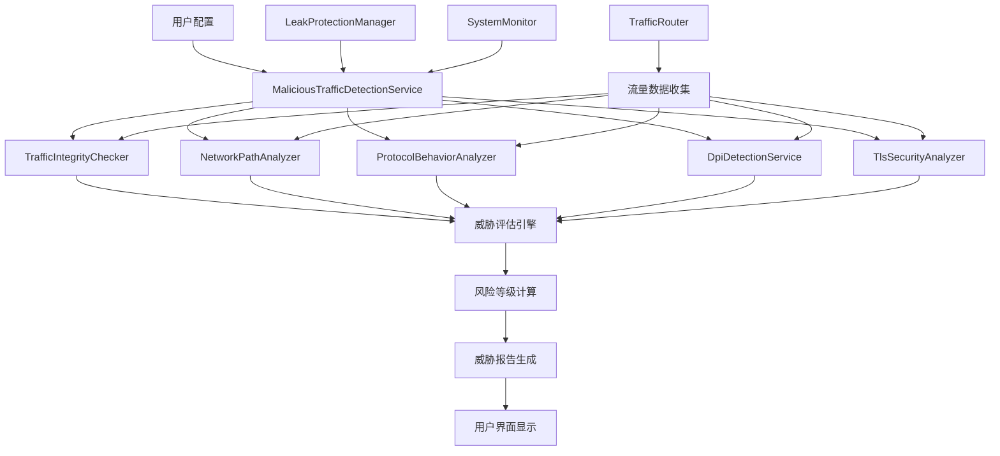

# 规划蓝图：恶意流量嗅探功能
*   **状态**: [规划中]

## 1. 核心目标与验收标准 (Core Objective & Acceptance Criteria)

### a. 核心目标 (Core Objective)
*   为虫洞代理客户端应用实现全面的恶意流量嗅探功能，检测和识别ISP恶意监控、流量干扰、DPI（深度包检测）、中间人攻击等网络威胁，构建主动式网络安全防护体系，为用户提供实时的网络环境安全评估和威胁预警。

### b. 验收标准 (Acceptance Criteria)
*   `[ ]` 用户可以在设置页面看到新增的"恶意流量检测"配置区域，包含检测类型、敏感度、检测频率等配置选项。
*   `[ ]` 系统能够检测并识别DNS劫持、DNS污染等DNS层面的恶意行为。
*   `[ ]` 系统能够检测并识别HTTP/HTTPS流量被篡改、注入恶意内容等攻击行为。
*   `[ ]` 系统能够检测并识别网络路径被重定向、中间代理注入等路由层面的威胁。
*   `[ ]` 系统能够检测并识别DPI设备、流量分析工具等深度包检测行为。
*   `[ ]` 系统能够检测并识别TLS握手异常、证书伪造等加密层面的攻击。
*   `[ ]` 所有检测功能必须与现有泄露防护系统无缝集成，形成统一的网络安全防护界面。
*   `[ ]` 系统提供实时威胁检测和风险等级评估，用户能够查看详细的威胁报告和安全建议。
*   `[ ]` 检测过程必须完全在本地进行，不涉及任何第三方服务，确保用户隐私安全。

## 2. 现状分析与复用性尽职调查 (Current State Analysis & Reuse Due Diligence)

### a. 复用性尽职调查
*   **搜索关键词**: `leak protection`, `traffic router`, `system monitor`, `dns service`, `http header protection`, `tls fingerprint`, `behavior analytics`
*   **搜索范围**: `src/main/services/`, `src/main/`, `src/shared/`
*   **发现与结论**:
    *   在 `src/main/services/leakProtectionManager.ts` 中发现了完整的泄露防护管理器，已实现多种网络防护功能。
    *   在 `src/main/trafficRouter.ts` 中发现了强大的流量监控和路由功能，具备实时流量分析能力。
    *   在 `src/main/systemMonitor.ts` 中发现了系统级监控功能，可扩展用于网络环境监控。
    *   在 `src/main/services/dnsService.ts` 中发现了DNS相关服务，可扩展用于DNS劫持检测。
    *   在 `src/main/services/httpHeaderProtectionService.ts` 中发现了HTTP头防护功能，可扩展用于流量篡改检测。
    *   在 `src/main/services/tlsFingerprintProtectionService.ts` 中发现了TLS相关功能，可扩展用于加密攻击检测。
    *   在 `src/main/services/behaviorAnalyticsService.ts` 中发现了行为分析功能，可扩展用于异常模式检测。
    *   **结论**: 现有架构完善，具备强大的网络监控和分析基础设施，可以基于现有服务扩展恶意流量检测功能，复用现有的配置管理、UI框架和监控系统。

### b. 潜在影响分析
*   本次修改将在现有网络安全防护体系基础上新增恶意流量检测功能，需要扩展多个现有服务类。
*   需要新增相应的类型定义、配置选项和检测算法，但不会影响现有功能的稳定性。
*   前端UI需要扩展设置页面和监控页面，但可以复用现有的配置框架和监控界面。
*   检测功能将增加一定的系统资源消耗，但通过智能采样和异步处理可以控制在可接受范围内。

## 3. 技术方案与架构设计 (Technical Approach & Architecture Design)

### a. 后端架构
*   **核心检测服务**:
    *   `MaliciousTrafficDetectionService`: 恶意流量检测的核心服务，负责协调各种检测器
    *   `TrafficIntegrityChecker`: 流量完整性检测器，检测数据包是否被篡改
    *   `NetworkPathAnalyzer`: 网络路径分析器，检测路由是否被重定向
    *   `ProtocolBehaviorAnalyzer`: 协议行为分析器，检测协议层面的异常
    *   `DpiDetectionService`: DPI检测服务，识别深度包检测设备
    *   `TlsSecurityAnalyzer`: TLS安全分析器，检测加密层面的攻击

*   **集成架构**:
    *   扩展现有的 `LeakProtectionManager`，将恶意流量检测作为新的防护类型
    *   利用现有的 `TrafficRouter` 进行流量监控和数据收集
    *   集成到现有的 `SystemMonitor` 进行系统级监控
    *   使用现有的配置管理系统进行设置管理

### b. 前端架构
*   **设置页面扩展**: 在现有泄露防护配置区域下方新增"恶意流量检测"配置区域
*   **监控页面扩展**: 扩展现有的监控界面，显示威胁检测结果和风险等级
*   **报告页面**: 新增威胁报告页面，提供详细的安全分析和建议
*   **复用现有组件**: 使用相同的Switch、Select、Slider等组件保持UI一致性

### c. 检测策略设计
*   **主动检测**: 定期发送测试流量进行检测
*   **被动检测**: 监控正常流量中的异常模式
*   **混合检测**: 结合主动和被动检测方法
*   **智能采样**: 根据网络活动情况动态调整检测频率

### d. 数据流设计

## 4. 任务分解与上下文锚点 (Task Breakdown & Context Anchors)

*   `[ ]` **里程碑1: 核心检测服务架构** (状态: `未开始`)
    *   `[ ]` 1.1: 扩展 `src/shared/types/index.ts`，新增恶意流量检测相关的类型定义
    *   `[ ]` 1.2: 扩展 `src/shared/defaultSettings.ts`，新增恶意流量检测的默认配置
    *   `[ ]` 1.3: 创建 `src/main/services/maliciousTrafficDetectionService.ts`
    *   `[ ]` 1.4: 创建 `src/main/services/trafficIntegrityChecker.ts`
    *   `[ ]` 1.5: 创建 `src/main/services/networkPathAnalyzer.ts`
    *   `[ ]` 1.6: 创建 `src/main/services/protocolBehaviorAnalyzer.ts`
    *   `[ ]` 1.7: **(验证点/上下文锚点)** 实现基础检测服务框架和接口定义。**[下次从这里继续]**

*   `[ ]` **里程碑2: 高级检测功能实现** (状态: `未开始`)
    *   `[ ]` 2.1: 创建 `src/main/services/dpiDetectionService.ts`
    *   `[ ]` 2.2: 创建 `src/main/services/tlsSecurityAnalyzer.ts`
    *   `[ ]` 2.3: 实现威胁评估引擎和风险等级计算算法
    *   `[ ]` 2.4: 实现威胁报告生成功能
    *   `[ ]` 2.5: **(验证点/上下文锚点)** 完成所有核心检测功能的实现和单元测试。**[下次从这里继续]**

*   `[ ]` **里程碑3: 系统集成与优化** (状态: `未开始`)
    *   `[ ]` 3.1: 扩展 `LeakProtectionManager`，集成恶意流量检测功能
    *   `[ ]` 3.2: 集成到 `TrafficRouter` 进行实时流量监控
    *   `[ ]` 3.3: 集成到 `SystemMonitor` 进行系统级监控
    *   `[ ]` 3.4: 实现智能采样和性能优化
    *   `[ ]` 3.5: **(验证点/上下文锚点)** 完成系统集成和性能优化。**[下次从这里继续]**

*   `[ ]` **里程碑4: 前端UI实现** (状态: `未开始`)
    *   `[ ]` 4.1: 扩展 `src/renderer/pages/Settings.tsx`，新增恶意流量检测配置区域
    *   `[ ]` 4.2: 扩展监控页面，显示威胁检测结果和风险等级
    *   `[ ]` 4.3: 创建威胁报告页面，提供详细的安全分析
    *   `[ ]` 4.4: 实现实时威胁通知和预警功能
    *   `[ ]` 4.5: **(验证点/上下文锚点)** 完成前端UI开发和用户交互测试。**[下次从这里继续]**

*   `[ ]` **里程碑5: 测试与优化** (状态: `未开始`)
    *   `[ ]` 5.1: 执行完整的恶意流量检测功能测试
    *   `[ ]` 5.2: 进行误报和漏报率测试和优化
    *   `[ ]` 5.3: 进行性能测试和资源消耗优化
    *   `[ ]` 5.4: 完善错误处理和日志记录
    *   `[ ]` 5.5: **(验证点/上下文锚点)** 生成完整的测试报告和用户文档。**[下次从这里继续]**

## 5. 风险评估与应对策略 (Risk Assessment & Mitigation Plan)

*   **风险1**: 检测准确性风险 - 误报和漏报可能影响用户体验
    *   **应对**: 实现机器学习模型，学习正常网络模式，建立动态阈值调整机制，提供用户自定义敏感度设置。

*   **风险2**: 性能影响风险 - 实时流量分析可能影响代理性能
    *   **应对**: 实现智能采样算法，采用异步处理机制，提供性能模式选择，允许用户在安全性和性能之间权衡。

*   **风险3**: 检测逃避风险 - 高级攻击者可能使用反检测技术
    *   **应对**: 采用多种检测方法，建立检测网络，实现检测方法的随机化和多样化。

*   **风险4**: 隐私安全风险 - 流量分析可能涉及隐私问题
    *   **应对**: 确保所有检测都在本地进行，不涉及任何第三方服务，实现数据最小化原则。

*   **风险5**: 兼容性风险 - 与现有代理功能可能产生冲突
    *   **应对**: 采用渐进式集成策略，提供功能开关，实现优雅降级机制。

*   **风险6**: 法律合规风险 - 某些检测方法可能违反当地法律
    *   **应对**: 确保所有功能符合当地法律法规，提供法律声明和使用条款。

## 6. 技术实现细节 (Technical Implementation Details)

### a. 检测算法设计
*   **流量完整性检测**:
    *   使用CRC32、MD5、SHA256等哈希算法检测数据包完整性
    *   实现数字签名验证机制
    *   检测HTTP响应头是否被修改

*   **网络路径分析**:
    *   实现Traceroute路径检测算法
    *   分析DNS解析结果的一致性
    *   检测网络延迟模式的异常

*   **协议行为分析**:
    *   分析TLS握手过程的时序和内容
    *   检测HTTP/HTTPS协议行为的合规性
    *   识别协议降级攻击模式

*   **DPI检测**:
    *   分析数据包的时间间隔模式
    *   检测TCP窗口大小和序列号的异常
    *   识别中间设备的指纹特征

### b. 性能优化策略
*   **智能采样**: 根据网络活动情况动态调整检测频率
*   **异步处理**: 使用Worker线程进行耗时的检测计算
*   **缓存机制**: 缓存检测结果，避免重复计算
*   **资源限制**: 设置检测功能的资源使用上限

### c. 数据存储设计
*   **检测结果存储**: 使用本地数据库存储检测历史
*   **配置管理**: 集成到现有的配置管理系统
*   **日志记录**: 实现详细的检测日志和错误日志

## 7. 用户界面设计 (User Interface Design)

### a. 设置页面扩展
*   **检测类型配置**: 允许用户选择启用的检测类型
*   **敏感度设置**: 提供低、中、高三个敏感度级别
*   **检测频率**: 允许用户设置检测的时间间隔
*   **通知设置**: 配置威胁通知的方式和级别

### b. 监控页面扩展
*   **实时威胁状态**: 显示当前网络环境的安全状态
*   **威胁等级指示器**: 使用颜色编码显示风险等级
*   **检测统计**: 显示检测次数、发现威胁数量等统计信息
*   **快速操作**: 提供一键检测、清除威胁等快速操作

### c. 威胁报告页面
*   **详细威胁分析**: 显示每个威胁的详细信息
*   **安全建议**: 提供针对性的安全改进建议
*   **历史记录**: 显示历史威胁检测记录
*   **导出功能**: 支持威胁报告的导出和分享

## 8. 测试策略 (Testing Strategy)

### a. 功能测试
*   **单元测试**: 为每个检测服务编写单元测试
*   **集成测试**: 测试各服务之间的集成
*   **端到端测试**: 测试完整的检测流程

### b. 性能测试
*   **负载测试**: 测试高流量情况下的性能表现
*   **内存测试**: 测试长时间运行的内存使用情况
*   **CPU测试**: 测试检测功能对CPU使用率的影响

### c. 准确性测试
*   **误报测试**: 测试正常网络环境下的误报率
*   **漏报测试**: 测试已知威胁的检测率
*   **边界测试**: 测试各种边界情况下的检测准确性

## 9. 部署和维护 (Deployment and Maintenance)

### a. 部署策略
*   **渐进式部署**: 先部署基础功能，再逐步增加高级功能
*   **A/B测试**: 在小范围用户中测试新功能
*   **回滚机制**: 提供快速回滚到稳定版本的能力

### b. 维护计划
*   **定期更新**: 定期更新检测算法和威胁数据库
*   **性能监控**: 持续监控系统性能和资源使用情况
*   **用户反馈**: 收集用户反馈，持续改进功能

### c. 文档和培训
*   **用户手册**: 编写详细的用户使用手册
*   **技术文档**: 维护完整的技术文档
*   **培训材料**: 为技术支持团队提供培训材料

## 10. 成功指标 (Success Metrics)

### a. 技术指标
*   **检测准确率**: 威胁检测的准确率 ≥ 95%
*   **误报率**: 误报率 ≤ 5%
*   **性能影响**: 对代理性能的影响 ≤ 10%
*   **资源消耗**: 内存使用增加 ≤ 50MB

### b. 用户体验指标
*   **用户满意度**: 用户满意度评分 ≥ 4.0/5.0
*   **功能使用率**: 恶意流量检测功能的使用率 ≥ 60%
*   **问题反馈**: 用户问题反馈数量 ≤ 每月10个

### c. 业务指标
*   **功能完整性**: 所有规划功能100%实现
*   **稳定性**: 系统稳定性 ≥ 99.5%
*   **响应时间**: 威胁检测响应时间 ≤ 5秒

---

**总结**: 恶意流量嗅探功能是一个具有重要安全价值的功能，虽然技术实现有一定复杂度，但基于项目现有的技术基础，完全可以实现。通过分阶段实施、渐进式集成和持续优化，可以为用户提供强大的网络安全防护能力。

